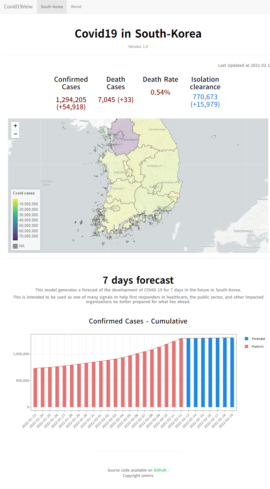

# Covid19View
*edit by ominiv*

## 프로젝트 목표
국내외 Covid19 발생현황을 보여주고 추후 어떻게 증감될 것인지 예측해보자.

---

## 주요업무
- 공공데이터 OpenApi를 활용해 데이터 수집
- 데이터 전처리 및 시각화
- 국내 확진자에 대한 시계열 데이터를 사용하여 예측모델 생성 (pytorch 기반 LSTM모델)
- shiny R package를 통해 Dashboard 생성

---
## 결과
- 국내외 Covid19 발생현황 정보 제공
- 7일 간의 확진자 예보 서비스 제공

    

---
## 아쉬운점
- shiny.io 무료버젼을 이용하다보니 이용시간과 application 개수의 제약이 있다. 서버를 구축해서 사용하는 쪽으로 진행 해야 유용 할 듯하다.

---

### TO-DO
- 정확도를 높이기 위해 deep-learning 방식말고 standard SEIR model에 병원데이터와 문서화되지 않은 추가해보자.  
- 코로나 관련 뉴스데이터를 추가 하여 예측정확도 개선
- 예측 정확도 추이 그래프생성

---

## Reference

 참고자료 

- [corona-live](https://corona-live.com/)
- [대한민국 SHP](http://www.gisdeveloper.co.kr/?p=2332)
- [SHP파일 적용예시](https://kuduz.tistory.com/1196)
- [지도시각화 참고자료](https://ysuks.shinyapps.io/dashboard/)
- [세계지도시각화 참고자료](https://dschloe.github.io/r/shiny/project_06_02/)
- [layout 참고](https://superkong1.tistory.com/15)
- [leaflet desc](https://inziwiduk.blogspot.com/2019/01/r-shiny-interactive-mapping.html)
- [위젯참고](https://wikidocs.net/71930)
- [LSTM](https://pseudo-lab.github.io/Tutorial-Book/chapters/time-series/Ch4-LSTM.html)
- [Google Forecast](https://datastudio.google.com/reporting/52f6e744-66c6-47aa-83db-f74201a7c4df/page/p_xasmskc9qc)
- [Google Forecast desc](https://cloud.google.com/blog/ko/products/ai-machine-learning/google-and-harvard-improve-covid-19-forecasts)
- [Hover Text](https://plotly.com/r/hover-text-and-formatting/)

 데이터 출처 

- [World_covid19 : 공공데이터활용지원센터_보건복지부 코로나19해외발생 현황](https://www.data.go.kr/iim/api/selectAPIAcountView.do)
- [Korea_*_covid19 : 공공데이터활용지원센터_보건복지부 코로나19 시·도발생 현황](https://www.data.go.kr/iim/api/selectAPIAcountView.do)
- [TL_SCCO_CTPRVN.shp : KOREA SHP FILE](http://www.gisdeveloper.co.kr/?p=2332)
- [WORLD SHP FILE](https://hub.arcgis.com/datasets/UIA::uia-world-countries-boundaries/about)

